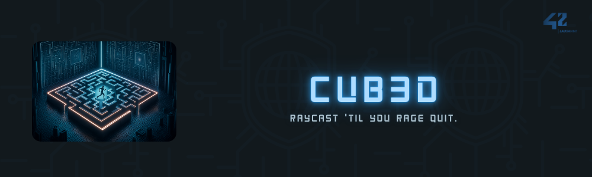

<br>

---

<br>

<details>
<summary>FRENCH VERSION</summary>

<br>

<div align="center">
<em>Bienvenue sur le repository de mon implémentation de Cub3D, un projet inspiré du jeu historique Wolfenstein 3D, considéré comme le premier FPS jamais développé. Ce projet a pour but de nous plonger dans le monde de la visualisation en 3D avec l'utilisation des techniques de ray-casting. L'objectif est de créer une vue dynamique à la première personne au sein d'un labyrinthe, en utilisant la bibliothèque graphique MiniLibX, fournie par l'école 42.</em>
</div>

<br>

---

### Usage

#### Installation

1. Cloner le dépôt : ```git clone https://github.com/aceyzz/Cub3d.git```
2. Naviguez dans le répertoire du projet ```cd Cub3D/```
3. Compiler le programme : ```make```

<br>

#### Utilisation

Pour lancer le jeu :
```bash
./cube maps/test1.cub # changer le nom de la map pour en tester d'autres
```

<br>

#### Commandes

Une fois le jeu lancé, l'écran d'accueil s'affiche (voir screenshot [ici](#screenshots)). 
Presser simplement `ENTER` pour accéder au jeu.

Voici les commandes du jeu :

| Commande                  | Action                          |
|---------------------------|---------------------------------|
| Click gauche ou `E`       | Tir                             |
| `Left Shift`              | Sprint                          |
| `W`/`A`/`S`/`D`           | Se déplacer                     |
| Touches directionnelles<br>ou Mouvement de la souris | Se tourner à gauche ou à droite |
| `P`                       | Mettre le jeu sur pause         |
| `M`                       | Mettre la musique sur pause     |


<br>

---

### Fonctionnement

1. **Vérification des arguments**

    Le programme commence par vérifier les arguments passés lors de l'exécution pour s'assurer qu'ils sont valides. Cela inclut la vérification de la présence d'un fichier de carte .cub qui décrit le monde du jeu.

2. **Parsing et initialisation des données de jeu**

    Cette étape implique la lecture et l'analyse du fichier de carte fourni pour extraire les informations nécessaires telles que la configuration de la carte, les textures, et les paramètres de départ. Les données sont ensuite initialisées dans les structures de données appropriées pour une utilisation ultérieure dans le jeu.

3. **Vérification des données de jeu**

    Une fois les données de jeu parseées, le programme vérifie leur validité. Cela inclut la vérification de la cohérence de la carte (pas de trous dans les murs, zone de jeu fermée, etc.) et la validité des textures et autres ressources référencées.

4. **Initialisation des données graphiques**

    Avant de lancer le jeu, Cub3D initialise les composants graphiques nécessaires, y compris la création de la fenêtre de jeu via MiniLibX et le chargement des textures. Cette étape prépare le programme à afficher le contenu à l'écran.

5. **Initialisation des fonctions de rappel (entrées utilisateur)**

    Les interactions de l'utilisateur avec le jeu sont gérées en initialisant des fonctions de rappel pour les entrées clavier et souris. Cela permet au joueur de se déplacer dans le labyrinthe et d'interagir avec le jeu de manière intuitive.

6. **Lancement du jeu & mise à jour du rendu en continu**

    Avec toutes les données prêtes et les systèmes en place, le jeu démarre. Le moteur de rendu en ray-casting entre en action, projetant la vue 3D du monde basée sur la position et l'orientation du joueur, avec une mise à jour continue pour refléter les mouvements et les interactions.

7. **Nettoyage des données et fermeture du programme**

    À la fin de la session de jeu, ou lorsqu'une demande de fermeture est initiée, le programme procède au nettoyage. Cela comprend la libération des ressources allouées, telles que les textures chargées et les structures de données, avant de fermer proprement le programme.

<br>

---

### Raycasting

1. Initialisation des Rayons

Chaque rayon que nous projetons dans notre monde 3D virtuel commence par une initialisation qui se base sur la position et l'orientation du joueur. Imaginez que devant les yeux du joueur, il y a une ligne (le plan de la caméra) sur laquelle nous projetons nos rayons. Pour chaque pixel sur l'axe horizontal de l'écran, nous calculons la direction du rayon à partir de la position du joueur, en ajustant l'angle pour qu'il corresponde à un point précis sur cette ligne. Cela nous permet de couvrir tout le champ de vision du joueur.

2. Avancement du Rayon avec l'Algorithme DDA

L'algorithme Digital Differential Analyzer (DDA) permet de faire avancer le rayon à travers la carte 2D. Il procède par pas, avançant soit horizontalement, soit verticalement, selon la direction du rayon. À chaque pas, nous vérifions si le rayon a atteint un mur en consultant la carte. Si c'est le cas, nous arrêtons l'algorithm; sinon, nous continuons. Cette méthode minimise le nombre de vérifications nécessaires pour trouver le mur le plus proche, rendant le processus efficace.

3. Calcul de la Distance Perpendiculaire

Une fois que nous avons trouvé un mur, nous calculons la distance entre le joueur et ce mur. Pour éviter l'effet de distorsion appelé "fish-eye", causé par le calcul de la distance directe, nous utilisons la distance perpendiculaire du rayon au mur. Cette distance est cruciale pour déterminer correctement la hauteur du mur à dessiner sur l'écran.

4. Détermination de la Hauteur du Mur à Dessiner

La hauteur du mur visible à l'écran est directement proportionnelle à la distance du mur au joueur : plus un mur est proche, plus il apparaîtra haut sur l'écran. Cette hauteur est calculée en utilisant la distance perpendiculaire trouvée à l'étape précédente. Nous ajustons ensuite le point de départ et le point d'arrivée du dessin sur l'écran pour s'assurer que le mur s'intègre parfaitement dans notre vue 3D.

5. Application des Textures sur les Murs

Pour rendre nos murs réalistes, nous appliquons des textures. Cela commence par déterminer la position exacte sur la texture correspondant au point où le rayon a touché le mur. Cette position est calculée en utilisant la distance perpendiculaire et la direction du rayon. Pour chaque pixel de la hauteur du mur, nous calculons ensuite la position verticale correspondante sur la texture (tex_y). Cela nous permet de dessiner chaque colonne de pixels à l'écran avec la couleur appropriée de la texture.

6. Répétition pour Chaque Colonne de l'Écran

Nous répétons ce processus pour chaque colonne de pixels sur l'écran, ce qui nous permet de construire l'ensemble de la scène vue par le joueur. Pour chaque colonne, un rayon est projeté, la distance au mur est calculée, la hauteur du mur est déterminée, et finalement, le mur est dessiné avec la texture appropriée.

<br>

---

## Arborescence

```shell
├── Makefile                 # Script de compilation
├── img                      # Images du projet
├── inc                      # Fichiers d'en-tête
│   ├── cube.h               # Header principal
│   ├── libft                # Bibliothèque utilitaire
│   └── mlx                  # Bibliothèque graphique
├── maps                     # Cartes du jeu
│   ├── bad                  # Cartes invalides
│   ├── good                 # Cartes valides
├── sound                    # Fichiers audio
│   ├── dryshot.mp3          # Son de tir à sec
│   ├── gunshot.mp3          # Son de tir
│   ├── reload.mp3           # Son de rechargement
│   └── soundtrack.mp3       # Bande sonore
└── src                      # Code source
	├── checks               # Vérifications des données
	│   ├── check_args.c     # Vérifie les arguments
	│   ├── check_map.c      # Vérifie la carte
	│   ├── check_map_border.c # Vérifie les bords de la carte
	│   ├── check_map_equalizer.c # Vérifie l'égalité de la carte
	│   ├── check_settings.c # Vérifie les paramètres
	│   └── check_utils.c    # Fonctions utilitaires de vérification
	├── cleaners             # Nettoyage des ressources
	│   ├── exit.c           # Gestion de la sortie
	│   └── free.c           # Libération de mémoire
	├── debugs               # Outils de débogage
	│   └── print_data.c     # Affiche les données
	├── draw                 # Dessin à l'écran
	│   ├── draw_utils.c     # Fonctions utilitaires de dessin
	│   ├── floor_ceiling.c  # Dessine sol et plafond
	│   ├── hud.c            # Dessine l'interface utilisateur
	│   ├── mini_moving.c    # Déplacement sur la minimap
	│   └── minimap.c        # Dessine la minimap
	├── game                 # Logique du jeu
	│   ├── bonus.c          # Gestion des bonus
	│   ├── bonus_utils.c    # Fonctions utilitaires des bonus
	│   ├── handle_move.c    # Gestion des déplacements
	│   ├── handle_rota.c    # Gestion des rotations
	│   ├── keypress.c       # Gestion des touches
	│   ├── main_game.c      # Boucle principale du jeu
	│   └── move_utils.c     # Fonctions utilitaires de mouvement
	├── init                 # Initialisation des données
	│   ├── init_data.c      # Initialise les données principales
	│   ├── init_map.c       # Initialise la carte
	│   ├── init_mini.c      # Initialise la minimap
	│   ├── init_mlx.c       # Initialise MiniLibX
	│   ├── init_player.c    # Initialise le joueur
	│   ├── init_rgb.c       # Initialise les couleurs
	│   ├── init_texture_next.c # Initialise les textures (suite)
	│   └── init_textures.c  # Initialise les textures
	├── main                 # Point d'entrée
	│   └── main.c           # Fonction principale
	├── raycast              # Gestion du raycasting
	│   ├── ray_texture.c    # Gestion des textures
	│   ├── ray_utils.c      # Fonctions utilitaires de raycasting
	│   └── raycasting.c     # Algorithme de raycasting
	└── sounds               # Gestion des sons
		└── sound_effect.c  # Effets sonores
```

<br>

### Screenshots


<div style="display: flex; justify-content: center; align-items: center;">
	
</div>

<br>

---

### Résultats


</details>

<br>

---

<br>

<details>
<summary>ENGLISH VERSION</summary>

<br>

<div align="center">
<em>Welcome to the repository of my implementation of Cub3D, a project inspired by the historic game Wolfenstein 3D, considered the first FPS ever developed. This project aims to immerse us in the world of 3D visualization using ray-casting techniques. The goal is to create a dynamic first-person view within a maze, using the MiniLibX graphics library provided by 42 school.</em>
</div>

<br>

---

### Usage

#### Installation

1. Clone the repository: ```git clone https://github.com/aceyzz/Cub3d.git```
2. Navigate to the project directory: ```cd Cub3D/```
3. Compile the program: ```make```

<br>

#### Usage

To launch the game:
```bash
./cube maps/test1.cub # change the map name to test others
```

<br>

#### Controls

Once the game is launched, the home screen will appear (see screenshot [here](#screenshots)). 
Simply press `ENTER` to access the game.

Here are the game controls:

| Command                   | Action                          |
|---------------------------|---------------------------------|
| Left click or `E`         | Shoot                           |
| `Left Shift`              | Sprint                          |
| `W`/`A`/`S`/`D`           | Move                            |
| Arrow keys<br>or Mouse movement | Turn left or right               |
| `P`                       | Pause the game                  |
| `M`                       | Pause the music                 |

<br>

---

### How It Works

1. **Argument Validation**

	The program starts by validating the arguments passed during execution to ensure they are correct. This includes checking for the presence of a .cub map file that describes the game world.

2. **Parsing and Initializing Game Data**

	This step involves reading and analyzing the provided map file to extract necessary information such as map configuration, textures, and starting parameters. The data is then initialized into appropriate data structures for later use in the game.

3. **Game Data Validation**

	Once the game data is parsed, the program validates it. This includes checking the map's consistency (no holes in walls, closed play area, etc.) and the validity of textures and other referenced resources.

4. **Graphics Data Initialization**

	Before launching the game, Cub3D initializes the required graphical components, including creating the game window via MiniLibX and loading textures. This step prepares the program to display content on the screen.

5. **Callback Function Initialization (User Inputs)**

	User interactions with the game are handled by initializing callback functions for keyboard and mouse inputs. This allows the player to navigate the maze and interact with the game intuitively.

6. **Game Launch & Continuous Rendering Update**

	With all data ready and systems in place, the game starts. The ray-casting rendering engine comes into action, projecting the 3D view of the world based on the player's position and orientation, with continuous updates to reflect movements and interactions.

7. **Data Cleanup and Program Exit**

	At the end of the game session, or when a close request is initiated, the program performs cleanup. This includes releasing allocated resources, such as loaded textures and data structures, before exiting the program cleanly.

<br>

---

### Raycasting

1. **Ray Initialization**

	Each ray projected into our virtual 3D world begins with initialization based on the player's position and orientation. Imagine a line (the camera plane) in front of the player's eyes where rays are projected. For each pixel on the screen's horizontal axis, we calculate the ray's direction from the player's position, adjusting the angle to match a specific point on this line. This allows us to cover the player's entire field of view.

2. **Ray Advancement with the DDA Algorithm**

	The Digital Differential Analyzer (DDA) algorithm advances the ray through the 2D map step by step, moving either horizontally or vertically depending on the ray's direction. At each step, we check if the ray has hit a wall by consulting the map. If it has, we stop the algorithm; otherwise, we continue. This method minimizes the number of checks needed to find the nearest wall, making the process efficient.

3. **Perpendicular Distance Calculation**

	Once a wall is found, we calculate the distance between the player and the wall. To avoid the "fish-eye" distortion effect caused by direct distance calculation, we use the perpendicular distance from the ray to the wall. This distance is crucial for correctly determining the wall's height to draw on the screen.

4. **Determining Wall Height to Draw**

	The visible wall height on the screen is directly proportional to the wall's distance from the player: the closer a wall is, the taller it appears on the screen. This height is calculated using the perpendicular distance found in the previous step. We then adjust the start and end points of the drawing on the screen to ensure the wall fits perfectly into our 3D view.

5. **Applying Textures to Walls**

	To make our walls realistic, we apply textures. This starts by determining the exact position on the texture corresponding to the point where the ray hit the wall. This position is calculated using the perpendicular distance and the ray's direction. For each pixel of the wall's height, we then calculate the corresponding vertical position on the texture (tex_y). This allows us to draw each column of pixels on the screen with the appropriate texture color.

6. **Repeating for Each Screen Column**

	We repeat this process for each column of pixels on the screen, allowing us to construct the entire scene visible to the player. For each column, a ray is projected, the wall distance is calculated, the wall height is determined, and finally, the wall is drawn with the appropriate texture.

<br>

---

## File Structure

```shell
├── Makefile                 # Compilation script
├── img                      # Project images
├── inc                      # Header files
│   ├── cube.h               # Main header
│   ├── libft                # Utility library
│   └── mlx                  # Graphics library
├── maps                     # Game maps
│   ├── bad                  # Invalid maps
│   ├── good                 # Valid maps
├── sound                    # Audio files
│   ├── dryshot.mp3          # Dry shot sound
│   ├── gunshot.mp3          # Gunshot sound
│   ├── reload.mp3           # Reload sound
│   └── soundtrack.mp3       # Soundtrack
└── src                      # Source code
	├── checks               # Data validation
	│   ├── check_args.c     # Argument validation
	│   ├── check_map.c      # Map validation
	│   ├── check_map_border.c # Map border validation
	│   ├── check_map_equalizer.c # Map equality validation
	│   ├── check_settings.c # Settings validation
	│   └── check_utils.c    # Validation utilities
	├── cleaners             # Resource cleanup
	│   ├── exit.c           # Exit handling
	│   └── free.c           # Memory freeing
	├── debugs               # Debugging tools
	│   └── print_data.c     # Data printing
	├── draw                 # Screen drawing
	│   ├── draw_utils.c     # Drawing utilities
	│   ├── floor_ceiling.c  # Floor and ceiling drawing
	│   ├── hud.c            # HUD drawing
	│   ├── mini_moving.c    # Minimap movement
	│   └── minimap.c        # Minimap drawing
	├── game                 # Game logic
	│   ├── bonus.c          # Bonus handling
	│   ├── bonus_utils.c    # Bonus utilities
	│   ├── handle_move.c    # Movement handling
	│   ├── handle_rota.c    # Rotation handling
	│   ├── keypress.c       # Key press handling
	│   ├── main_game.c      # Main game loop
	│   └── move_utils.c     # Movement utilities
	├── init                 # Data initialization
	│   ├── init_data.c      # Main data initialization
	│   ├── init_map.c       # Map initialization
	│   ├── init_mini.c      # Minimap initialization
	│   ├── init_mlx.c       # MiniLibX initialization
	│   ├── init_player.c    # Player initialization
	│   ├── init_rgb.c       # Color initialization
	│   ├── init_texture_next.c # Texture initialization (continued)
	│   └── init_textures.c  # Texture initialization
	├── main                 # Entry point
	│   └── main.c           # Main function
	├── raycast              # Raycasting management
	│   ├── ray_texture.c    # Texture management
	│   ├── ray_utils.c      # Raycasting utilities
	│   └── raycasting.c     # Raycasting algorithm
	└── sounds               # Sound management
		└── sound_effect.c  # Sound effects
```

<br>

### Screenshots


<div style="display: flex; justify-content: center; align-items: center;">
	
</div>

<br>

---

### Results


</details>