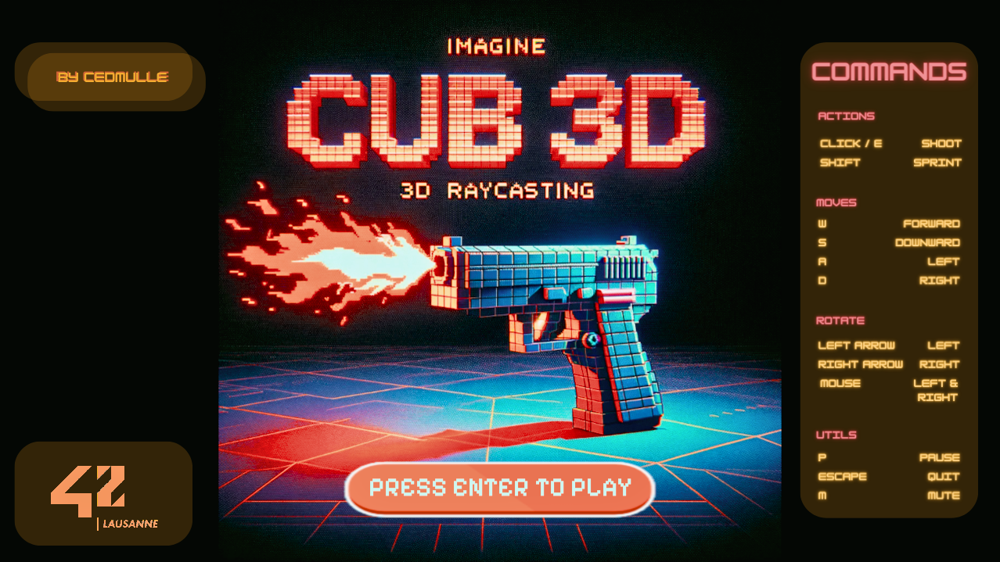

---

### Level 4 - Common Core

<div align="center">
<em>Bienvenue sur le repository de mon implémentation de Cub3D, un projet inspiré du jeu historique Wolfenstein 3D, considéré comme le premier FPS jamais développé. Ce projet a pour but de nous plonger dans le monde de la visualisation en 3D avec l'utilisation des techniques de ray-casting. L'objectif est de créer une vue dynamique à la première personne au sein d'un labyrinthe, en utilisant la bibliothèque graphique MiniLibX, fournie par l'école 42.</em>
</div>

<br>

---

### Usage

#### Installation

1. Cloner le dépôt : ```git clone https://github.com/aceyzz/Cub3d.git```
2. Naviguez dans le répertoire du projet ```cd Cub3D/```
3. Compiler le programme : ```make```

<br>

#### Utilisation

Pour lancer le jeu :
```
./cube <path/to/map.cub>
```
Remplacer le <path/to/map.cub> par le chemin de la map souhaitée, par exemple :
```
./cube maps/test1.cub
```

<br>

#### Commandes

Une fois le jeu lancé, l'écran d'accueil s'affiche (voir screenshot [ici](#screenshots)). 
Presser simplement `ENTER` pour accéder au jeu.

Voici les commandes du jeu :

| Commande                  | Action                          |
|---------------------------|---------------------------------|
| Click gauche ou `E`       | Tir                             |
| `Left Shift`              | Sprint                          |
| `W`/`A`/`S`/`D`           | Se déplacer                     |
| Touches directionnelles<br>ou Mouvement de la souris | Se tourner à gauche ou à droite |
| `P`                       | Mettre le jeu sur pause         |
| `M`                       | Mettre la musique sur pause     |


<br>

---

### Fonctionnement

1. **Vérification des arguments**

    Le programme commence par vérifier les arguments passés lors de l'exécution pour s'assurer qu'ils sont valides. Cela inclut la vérification de la présence d'un fichier de carte .cub qui décrit le monde du jeu.

2. **Parsing et initialisation des données de jeu**

    Cette étape implique la lecture et l'analyse du fichier de carte fourni pour extraire les informations nécessaires telles que la configuration de la carte, les textures, et les paramètres de départ. Les données sont ensuite initialisées dans les structures de données appropriées pour une utilisation ultérieure dans le jeu.

3. **Vérification des données de jeu**

    Une fois les données de jeu parseées, le programme vérifie leur validité. Cela inclut la vérification de la cohérence de la carte (pas de trous dans les murs, zone de jeu fermée, etc.) et la validité des textures et autres ressources référencées.

4. **Initialisation des données graphiques**

    Avant de lancer le jeu, Cub3D initialise les composants graphiques nécessaires, y compris la création de la fenêtre de jeu via MiniLibX et le chargement des textures. Cette étape prépare le programme à afficher le contenu à l'écran.

5. **Initialisation des fonctions de rappel (entrées utilisateur)**

    Les interactions de l'utilisateur avec le jeu sont gérées en initialisant des fonctions de rappel pour les entrées clavier et souris. Cela permet au joueur de se déplacer dans le labyrinthe et d'interagir avec le jeu de manière intuitive.

6. **Lancement du jeu & mise à jour du rendu en continu**

    Avec toutes les données prêtes et les systèmes en place, le jeu démarre. Le moteur de rendu en ray-casting entre en action, projetant la vue 3D du monde basée sur la position et l'orientation du joueur, avec une mise à jour continue pour refléter les mouvements et les interactions.

7. **Nettoyage des données et fermeture du programme**

    À la fin de la session de jeu, ou lorsqu'une demande de fermeture est initiée, le programme procède au nettoyage. Cela comprend la libération des ressources allouées, telles que les textures chargées et les structures de données, avant de fermer proprement le programme.

<br>

---

### Raycasting

1. Initialisation des Rayons

Chaque rayon que nous projetons dans notre monde 3D virtuel commence par une initialisation qui se base sur la position et l'orientation du joueur. Imaginez que devant les yeux du joueur, il y a une ligne (le plan de la caméra) sur laquelle nous projetons nos rayons. Pour chaque pixel sur l'axe horizontal de l'écran, nous calculons la direction du rayon à partir de la position du joueur, en ajustant l'angle pour qu'il corresponde à un point précis sur cette ligne. Cela nous permet de couvrir tout le champ de vision du joueur.

2. Avancement du Rayon avec l'Algorithme DDA

L'algorithme Digital Differential Analyzer (DDA) permet de faire avancer le rayon à travers la carte 2D. Il procède par pas, avançant soit horizontalement, soit verticalement, selon la direction du rayon. À chaque pas, nous vérifions si le rayon a atteint un mur en consultant la carte. Si c'est le cas, nous arrêtons l'algorithm; sinon, nous continuons. Cette méthode minimise le nombre de vérifications nécessaires pour trouver le mur le plus proche, rendant le processus efficace.

3. Calcul de la Distance Perpendiculaire

Une fois que nous avons trouvé un mur, nous calculons la distance entre le joueur et ce mur. Pour éviter l'effet de distorsion appelé "fish-eye", causé par le calcul de la distance directe, nous utilisons la distance perpendiculaire du rayon au mur. Cette distance est cruciale pour déterminer correctement la hauteur du mur à dessiner sur l'écran.

4. Détermination de la Hauteur du Mur à Dessiner

La hauteur du mur visible à l'écran est directement proportionnelle à la distance du mur au joueur : plus un mur est proche, plus il apparaîtra haut sur l'écran. Cette hauteur est calculée en utilisant la distance perpendiculaire trouvée à l'étape précédente. Nous ajustons ensuite le point de départ et le point d'arrivée du dessin sur l'écran pour s'assurer que le mur s'intègre parfaitement dans notre vue 3D.

5. Application des Textures sur les Murs

Pour rendre nos murs réalistes, nous appliquons des textures. Cela commence par déterminer la position exacte sur la texture correspondant au point où le rayon a touché le mur. Cette position est calculée en utilisant la distance perpendiculaire et la direction du rayon. Pour chaque pixel de la hauteur du mur, nous calculons ensuite la position verticale correspondante sur la texture (tex_y). Cela nous permet de dessiner chaque colonne de pixels à l'écran avec la couleur appropriée de la texture.

6. Répétition pour Chaque Colonne de l'Écran

Nous répétons ce processus pour chaque colonne de pixels sur l'écran, ce qui nous permet de construire l'ensemble de la scène vue par le joueur. Pour chaque colonne, un rayon est projeté, la distance au mur est calculée, la hauteur du mur est déterminée, et finalement, le mur est dessiné avec la texture appropriée.

<br>

---

### Screenshots




<div style="display: flex; justify-content: center;">
	
</div>

<br>

---

### Résultats


